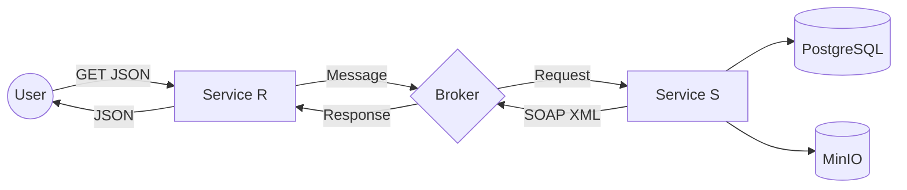

# 🎓 Student Info System: Multi-Module Microservices

A robust distributed system built with **Spring Boot**, implementing an asynchronous data retrieval pattern via **Message Broker** and integrating multiple storage types (**PostgreSQL** & **MinIO**).

## 🏗 System Architecture

The project follows a specific data-flow scenario:
1.  **Service R (REST/SOAP Gateway)**: Receives user requests via REST, converts them, and sends them to the Broker.
2.  **Message Broker (RabbitMQ/Kafka)**: Handles asynchronous communication between services.
3.  **Service S (Data Provider)**: Orchestrates data from PostgreSQL (relational data) and MinIO (binary data/photos) via SOAP.



---

## 🛠 Tech Stack

| Component | Technology |
| :--- | :--- |
| **Framework** | Spring Boot 3.x |
| **Messaging** | RabbitMQ / Apache Kafka |
| **Database** | PostgreSQL |
| **Object Storage** | MinIO (S3 Compatible) |
| **Integration** | Apache Camel (Optional) |
| **API Docs** | Swagger / OpenAPI 3 |
| **Containerization** | Docker & Docker Compose |

---

## 📂 Project Structure

```text
.
├── service-r/             # REST Gateway & XML/JSON Transformer
├── service-s/             # SOAP Service & Data Orchestrator
├── common-lib/            # Shared DTOs and SOAP Schemas
├── docker-compose.yaml    # Infrastructure orchestration
└── README.md
```

---

## 🚀 Getting Started

### Prerequisites
* Docker & Docker Compose
* JDK 17+ (for local development)
* Maven

### 1. Build the Applications
From the root directory:
```bash
mvn clean package -DskipTests
```

### 2. Run the Environment
Launch all containers (Services, PostgreSQL, MinIO, Broker):
```bash
docker-compose up -d
```

### 3. Initialize Data
* **PostgreSQL**: Tables are auto-created via Liquibase/Flyway or Hibernate.
* **MinIO**: Access the console at `http://localhost:9001` (login: `minioadmin` / `minioadmin`) and create a bucket named `student-photos`.

---

## 📡 API Endpoints

### Service R (Gateway)
* **GET** `/api/students` — Fetch all students list.
* **GET** `/api/students/{id}` — Fetch specific student details with photo link.
* **Swagger UI**: `http://localhost:8081/swagger-ui.html`

### Service S (SOAP)
* **WSDL**: `http://localhost:8082/ws/students.wsdl`
* **Endpoints**: `getAllUnits`, `getOneUnit`

---

## 🔄 Data Flow Scenario

1.  **Request**: User hits `GET /api/students/123` on **Service R**.
2.  **Logging**: Service R logs: `[INFO] Received request for student 123`.
3.  **Produce**: Service R transforms request to internal format and sends to `request.queue`.
4.  **Consume**: **Service S** picks up the message, queries **PostgreSQL** for student info and **MinIO** for the photo URL.
5.  **Transform**: Service S generates a SOAP XML response and sends it to `response.queue`.
6.  **Deliver**: Service R consumes the XML, converts it to **JSON**, and returns it to the browser.

---

## 🔐 Security & Features
* **Spring Security**: Basic Auth implemented for Service R.
* **Data Transformation**: Custom Jackson/JAXB logic for XML/JSON marshaling.
* **Fault Tolerance**: Docker health checks ensure services start only when the Broker and DB are ready.

---
*Developed as a technical demonstration for distributed systems.*

---

### How to use this for your project:
1.  Save this as `README.md` in your project root.
2.  If you used **Apache Camel**, uncomment or highlight the Camel section.
3.  Replace placeholder ports (8081, 8082) with the actual ones used in your `application.yaml`.
